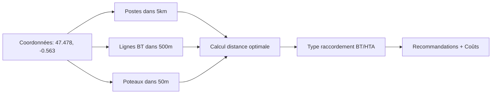

# API ENEDIS

# ⚡ Service d'enrichissement Enedis (Réseau électrique)

Ce document explique le fonctionnement du service d'enrichissement des données de raccordement électrique utilisant l'API Enedis Open Data.

## 🎯 Objectif

À partir de **coordonnées géographiques** (latitude/longitude) ou d'un **Identifiant de Parcelle Cadastrale**, le service enrichit automatiquement les informations d'une friche en récupérant :

- La distance au point de raccordement électrique le plus proche
- Le type de raccordement optimal (BT ou HTA)  
- Le statut de connexion avec niveau de confiance
- Les recommandations contextuelles pour le raccordement
- L'estimation des coûts de raccordement
- L'inventaire des infrastructures électriques environnantes

## 🌐 API Enedis Open Data - Ressources

### Accès à l'API

- **URL de base** : `https://data.enedis.fr/api/explore/v2.1/catalog/datasets`
- **Portail officiel** : <https://data.enedis.fr/>
- **Documentation** : <https://data.enedis.fr/explore/?sort=modified>
- **Catalogue datasets** : <https://data.enedis.fr/api/datasets/1.0/search/>

### Caractéristiques

- **Gratuite** : API publique sans clé requise
- **Service public** : Fourni par Enedis (gestionnaire du réseau de distribution)
- **Données officielles** : Infrastructures réelles du réseau électrique français
- **Format** : Réponses JSON standardisées (OpenDataSoft)
- **Couverture** : Réseau de distribution France métropolitaine + DROM
- **Mise à jour** : Deux fois par an

### Limites API publique

- **Données indicatives** : Sans garantie de complétude ni d'exactitude fine
- **Pas de valeur DT-DICT** : Ne remplace pas les procédures réglementaires obligatoires
- **Pas de données client** : Aucune information sur les Points De Livraison (PDL)
- **Limites géographiques** : Filtres par distance ou zone (bbox)

## 🗺️ Datasets utilisés par Mutafriches

### 1️⃣ Postes électriques (`poste-electrique`)

**Description** : Position des postes de distribution publique (postes HTA/BT)

**Utilisation** : Calcul de la distance de raccordement principale

**Données clés** :

- `geo_point_2d` : Coordonnées latitude/longitude
- `nom_commune`, `code_commune` : Localisation administrative
- `code_region`, `nom_region` : Contexte régional

**Exemple de recherche** :

```
/poste-electrique/records?geofilter.distance=47.478419,-0.563166,5000&limit=50
```

### 2️⃣ Lignes BT aériennes (`reseau-bt`)

**Description** : Tracé des lignes électriques basse tension aériennes

**Utilisation** : Détection de raccordements BT courts (< 100m)

**Données clés** :

- `geo_point_2d` : Points du tracé de ligne
- `nature` : Type de ligne (Aérien/Souterrain)
- `tension` : Niveau de tension (BT)
- `longueur` : Longueur du segment en mètres

**Exemple de recherche** :

```
/reseau-bt/records?geofilter.distance=47.478419,-0.563166,500&limit=100
```

### 3️⃣ Lignes BT souterraines (`reseau-souterrain-bt`)

**Description** : Tracé des lignes électriques basse tension souterraines

**Utilisation** : Complément des lignes aériennes pour couverture totale

**Données similaires au dataset `reseau-bt`**

### 4️⃣ Poteaux électriques (`position-geographique-des-poteaux-hta-et-bt`)

**Description** : Position géographique des poteaux électriques HTA et BT

**Utilisation** : Affinage de la précision, détection de densité réseau

**Données clés** :

- `geo_point_2d` : Position exacte du poteau
- `tension` : Type de tension (HTA ou BT)
- `type_poteau` : Caractéristiques du support

**Exemple de recherche** :

```
/position-geographique-des-poteaux-hta-et-bt/records?geofilter.distance=47.478419,-0.563166,200&limit=30
```

## 🔧 Architecture du service

### Stratégie de recherche multi-sources

Le service Enedis utilise une approche par rayons concentrique pour optimiser les résultats :



### Rayons de recherche optimisés

| **Infrastructure** | **Rayon** | **Objectif** |
|-------------------|-----------|--------------|
| **Postes HTA/BT** | 5000m | Raccordement principal, extension réseau |
| **Lignes BT** | 500m | Raccordement direct, branchement court |
| **Poteaux** | 50m-200m | Précision, validation densité réseau |

## 🎯 Logique métier du service

### Algorithme de détermination du raccordement optimal

```typescript
// 1. Priorité au raccordement BT si ligne BT < 100m
if (ligneBTProche && ligneBTProche.distance < 100) {
  return {
    type: 'BT',
    distance: ligneBTProche.distance / 1000, // km
    capaciteDisponible: true
  };
}

// 2. Raccordement depuis le poste le plus proche
else if (posteProche) {
  return {
    type: posteProche.distance < 200 ? 'BT' : 'HTA',
    distance: posteProche.distance / 1000,
    capaciteDisponible: posteProche.distance < 1000
  };
}

// 3. Extension de réseau nécessaire
else {
  return {
    type: 'HTA',
    capaciteDisponible: false
  };
}
```

### Niveau de confiance

Le service calcule automatiquement un niveau de confiance basé sur :

- **High** : Lignes BT ou poteaux détectés dans un rayon proche (< 100m)
- **Medium** : Postes électriques détectés dans un rayon raisonnable (< 2km)
- **Low** : Infrastructures éloignées ou données limitées

### Calcul des coûts estimés

Estimation indicative basée sur la distance et le type de raccordement :

```typescript
// Coût de base
let coutMin = 1000; // €
let coutMax = 3000; // €

// Ajustement distance (au-delà de 100m)
if (distance > 0.1) {
  const coutExtension = distance * (type === 'BT' ? 100 : 200) * 1000;
  coutMin += coutExtension * 0.8;
  coutMax += coutExtension * 1.5;
}

// Ajustement type HTA (plus complexe)
if (type === 'HTA') {
  coutMin += 2000;
  coutMax += 8000;
}
```

## 📊 Interfaces de service

### 1️⃣ Service `getDistanceRaccordement()`

**Utilisation** : Calcul de distance et type de raccordement optimal

```typescript
async getDistanceRaccordement(
  latitude: number, 
  longitude: number
): Promise<ApiResponse<EnedisRaccordement>>

interface EnedisRaccordement {
  distance: number;                    // Distance en km
  type: 'BT' | 'HTA';                 // Type de raccordement
  capaciteDisponible: boolean;         // Estimation de capacité
  posteProche?: {                      // Poste électrique le plus proche
    nom: string;
    commune: string;
    coordonnees: { latitude: number; longitude: number };
  };
  infrastructureProche?: {             // Infrastructure la plus proche
    type: 'poste' | 'ligne_bt' | 'poteau';
    distance: number;                  // en mètres
    tension: 'BT' | 'HTA';
  };
}
```

### 2️⃣ Service `checkConnection()`

**Utilisation** : Vérification du statut de connexion d'une parcelle

```typescript
async checkConnection(
  identifiantParcelle: string
): Promise<ApiResponse<EnedisConnexionStatus>>

interface EnedisConnexionStatus {
  isConnected: boolean;                // Infrastructures détectées
  confidence: 'high' | 'medium' | 'low'; // Niveau de confiance
  sources: string[];                   // Sources de données utilisées
  details: {
    postesProches: number;             // Nombre dans rayon 2km
    lignesBTProches: number;           // Nombre dans rayon 100m  
    poteauxProches: number;            // Nombre dans rayon 50m
  };
}
```

### 3️⃣ Service `analyseComplete()`

**Utilisation** : Analyse complète avec recommandations et coûts

```typescript
async analyseComplete(
  latitude: number,
  longitude: number
): Promise<ApiResponse<EnedisAnalyseComplete>>

interface EnedisAnalyseComplete {
  raccordement: EnedisRaccordement;    // Données de raccordement
  connexion: EnedisConnexionStatus;    // Statut de connexion
  recommandations: string[];           // Recommandations contextuelles
  coutEstime?: {                       // Estimation financière
    min: number;
    max: number;
    devise: 'EUR';
    commentaire: string;
  };
}
```

### 4️⃣ Service `rechercherInfrastructures()`

**Utilisation** : Inventaire détaillé des infrastructures dans un rayon

```typescript
async rechercherInfrastructures(
  latitude: number,
  longitude: number,
  rayonMetres?: number
): Promise<ApiResponse<{
  postes: Array<{ distance: number; nom: string; commune: string }>;
  lignesBT: Array<{ distance: number; type: string; tension: string }>;
  poteaux: Array<{ distance: number; tension: string }>;
}>>
```

## 💡 Exemples d'utilisation

### Exemple 1 : Raccordement favorable (zone urbaine)

**Coordonnées** : Paris La Défense (48.8905, 2.2385)

```json
{
  "success": true,
  "source": "enedis-api",
  "data": {
    "distance": 0.12,
    "type": "BT", 
    "capaciteDisponible": true,
    "infrastructureProche": {
      "type": "ligne_bt",
      "distance": 45,
      "tension": "BT"
    }
  }
}
```

**Interprétation** : Raccordement BT direct, branchement court de 45m, procédure simplifiée

### Exemple 2 : Raccordement complexe (zone rurale)

**Coordonnées** : Zone rurale Mayenne (48.1234, -0.7890)

```json
{
  "success": true,
  "source": "enedis-api", 
  "data": {
    "distance": 2.3,
    "type": "HTA",
    "capaciteDisponible": false,
    "posteProche": {
      "nom": "Poste Rural",
      "commune": "Village-Test",
      "coordonnees": { "latitude": 48.125, "longitude": -0.788 }
    }
  }
}
```

**Interprétation** : Extension réseau HTA nécessaire, étude technique complexe requise

### Exemple 3 : Analyse complète avec recommandations

```json
{
  "success": true,
  "source": "enedis-api",
  "data": {
    "raccordement": { /* ... */ },
    "connexion": {
      "isConnected": true,
      "confidence": "high",
      "sources": ["postes-electriques", "reseau-bt", "poteaux-hta-bt"]
    },
    "recommandations": [
      "Raccordement favorable - Extension courte nécessaire",
      "Raccordement BT possible - Procédure simplifiée", 
      "Respecter la réglementation DT-DICT avant tous travaux"
    ],
    "coutEstime": {
      "min": 3200,
      "max": 8500,
      "devise": "EUR",
      "commentaire": "Estimation indicative - Devis officiel Enedis requis"
    }
  }
}
```

## 🚀 Performances et optimisations

### Métriques typiques

- **Temps de réponse** : 800ms - 3s (selon densité réseau zone)
- **Disponibilité** : 99.5% (API publique Enedis)
- **Précision distance** : ±10m (formule haversine)
- **Cache Enedis** : Données mises à jour 2x/an

### Optimisations implémentées

- **Recherches parallèles** : `Promise.all()` sur les 3 datasets
- **Rayons adaptés** : Optimisés par type d'infrastructure
- **Calcul local distance** : Formule haversine pour tri précis
- **Fallback gracieux** : Dégradation en cas d'API indisponible
- **Timeout configuré** : 10 secondes maximum

### Gestion des erreurs réseau

```typescript
// Patterns de retry et fallback
try {
  const response = await this.callEnedisApi(params);
  return response.results.map(/* transformation */);
} catch (error) {
  console.warn(`Dataset ${dataset} non disponible: ${error.message}`);
  return []; // Fallback gracieux
}
```

## ❌ Gestion d'erreurs

### Erreurs API courantes

| **Erreur** | **Cause** | **Solution** |
|------------|-----------|--------------|
| `Aucune infrastructure trouvée` | Zone très isolée ou coordonnées hors France | Vérifier coordonnées ou accepter distance importante |
| `Timeout API Enedis` | Surcharge serveur ou requête complexe | Retry automatique, réduction périmètre |
| `Dataset temporairement indisponible` | Maintenance Enedis | Fallback sur autres datasets |
| `Coordonnées invalides` | Latitude/longitude hors limites | Validation côté client |

### Codes de retour

```json
// Succès avec infrastructure proche
{
  "success": true,
  "source": "enedis-api",
  "data": {
    "distance": 0.25,
    "type": "BT", 
    "capaciteDisponible": true
  }
}

// Succès mais zone isolée  
{
  "success": true,
  "source": "enedis-api",
  "data": {
    "distance": 999,
    "type": "HTA",
    "capaciteDisponible": false
  }
}

// Échec technique
{
  "success": false,
  "source": "enedis-api", 
  "error": "Erreur lors du calcul de la distance de raccordement"
}
```

## 🧪 Tests et validation

### Coordonnées de test validées

```json
{
  "47.478419,-0.563166": "Angers centre - Infrastructure urbaine dense",
  "48.8905,2.2385": "Paris La Défense - Zone très dense, raccordement BT",
  "45.7596,4.8590": "Lyon Part-Dieu - Centre d'affaires, mix BT/HTA", 
  "43.2956,5.3708": "Marseille Vieux-Port - Zone historique urbaine",
  "48.1234,-0.7890": "Zone rurale Mayenne - Infrastructure limitée"
}
```

### Coordonnées d'erreur pour tests

```json
{
  "999,999": "Coordonnées invalides",
  "55.0,10.0": "Hors couverture France métropolitaine",
  "42.0,-5.5": "Zone maritime, aucune infrastructure"
}
```

### Outils de debug

- **Contrôleur de test** : `/test/enedis/*` (endpoints dédiés)
  - `/test/enedis/connexion?parcelle=25056000HZ0346&lat=47.23662566&lng=6.00896827` (avec coordonnées)
- **Comparaison directe** : URLs API Enedis brutes pour validation
- **Analyse complète** : Swagger UI pour tests interactifs
- **Collections Postman** : Scénarios de test automatisés

## 🎯 Intégration dans Mutafriches

### Utilisation dans l'enrichissement de parcelles

```typescript
// Dans ParcelleEnrichmentService
private async enrichWithEnedisData(parcelle: Parcelle, coordonnees: Coordinates) {
  // 1. Vérification connexion électrique  
  const connexionResult = await this.enedisService.checkConnection(
  parcelle.id, 
  coordonnees
  );
  parcelle.connectionReseauElectricite = connexionResult.data?.isConnected;

  // 2. Calcul distance raccordement
  const raccordementResult = await this.enedisService.getDistanceRaccordement(
    coordonnees.latitude, 
    coordonnees.longitude
  );
  parcelle.distanceRaccordementElectrique = raccordementResult.data?.distance;
}
```

### Correspondance avec le modèle Excel original

| **Champ Excel** | **Service Enedis** | **Transformation** |
|-----------------|-------------------|-------------------|
| "Distance point raccordement BT/HT" | `getDistanceRaccordement().distance` | km → conversion si nécessaire |
| "Type raccordement" | `getDistanceRaccordement().type` | 'BT' ou 'HTA' |
| "Raccordement électrique possible" | `checkConnection().isConnected` | boolean |

## ⚠️ Limites et considérations légales

### Limites techniques

- **Données indicatives** : Pas de garantie d'exactitude fine
- **Complétude variable** : Certains datasets peuvent être partiels selon les régions
- **Mise à jour semestrielle** : Décalage possible avec réalité terrain récente
- **Pas de capacité réseau** : Aucune information sur la charge/disponibilité

### Obligations réglementaires

> ⚠️ **Important** : Les données Enedis Open Data sont **indicatives** et ne dispensent pas :
>
> - **DT-DICT obligatoire** : Déclaration d'Intention de Commencement de Travaux
> - **Pré-étude Enedis officielle** : Pour chiffrage et faisabilité réels  
> - **Étude de raccordement** : Procédure officielle pour tout projet

### Recommandations d'usage

```typescript
// Pattern recommandé pour les recommandations
const recommandations = [
  // Toujours inclure l'avertissement légal
  'Respecter la réglementation DT-DICT avant tous travaux',
  
  // Recommandation selon niveau de confiance  
  connexion.confidence === 'low' 
    ? 'Contacter Enedis pour pré-étude officielle'
    : 'Demander devis raccordement Enedis',
    
  // Conseil selon complexité
  raccordement.distance > 1
    ? 'Étude de faisabilité technique recommandée' 
    : 'Raccordement standard envisageable'
];
```

## 📈 Évolution et roadmap

### Améliorations prévues

- **Intégration cadastre** : Récupération automatique coordonnées depuis IDU parcelle
- **Cache intelligent** : Optimisation des appels répétés
- **Données capacité** : Si API Enedis évolue vers données plus précises
- **Historique raccordements** : Suivi des analyses par projet

### APIs Enedis alternatives

- **API Enedis professionnelle** : Données plus précises, authentifiées
- **API SGE** : Système de Gestion des Énergies (en développement)
- **Portail Enedis Connect** : Interface dédiée professionnels

## 📚 Ressources complémentaires

### Documentation officielle Enedis

- [Portail Open Data Enedis](https://data.enedis.fr/)
- [Documentation API](https://data.enedis.fr/explore/?sort=modified)
- [Conditions d'utilisation](https://data.enedis.fr/pages/conditions-dutilisation/)
- [Catalogue complet datasets](https://data.enedis.fr/api/datasets/1.0/search/)

### Outils de validation externe

- **Géoportail de l'urbanisme** : Visualisation réseaux
- **DICT.fr** : Procédures réglementaires
- **Enedis Connect** : Portail professionnel officiel
- **RTE-France** : Données réseau transport (complémentaire)

### Sources techniques  

- **OpenDataSoft** : Format API standardisé
- **Projection RGF93** : Système géodésique français
- **Formule Haversine** : Calcul distances géographiques précises

---

> **Note importante** : Ce service fournit des **estimations indicatives** pour l'aide à la décision. Pour tout projet de raccordement réel, contacter Enedis directement pour une pré-étude officielle et un devis personnalisé. Les données sont mises à jour semestriellement et peuvent présenter un décalage avec la réalité terrain.
