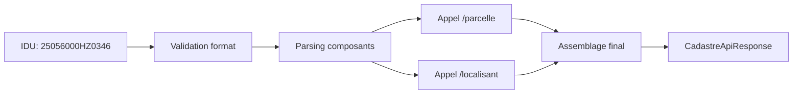

# API IGN Cadastre

# 📍 Service d'enrichissement cadastral IGN

Ce document explique le fonctionnement du service d'enrichissement des données cadastrales utilisant l'API IGN Cadastre.

## 🎯 Objectif

À partir d'un **Identifiant de Parcelle Cadastrale (IDU)**, le service enrichit automatiquement les informations de base d'une parcelle en récupérant :

- Le nom officiel de la commune
- La surface exacte en m²
- Les coordonnées GPS du centroïde

## 🌐 API IGN Cadastre - Ressources

### Accès à l'API

- **URL de base** : `https://apicarto.ign.fr/api/cadastre`
- **Documentation officielle** : https://apicarto.ign.fr/api/doc/cadastre
- **Documentation utilisateur (PDF)** : [Guide utilisateur API Carto Cadastre](https://apicarto.ign.fr/api/doc/pdf/docUser_moduleCadastre.pdf)

### Caractéristiques

- **Gratuite** : Aucune clé API requise
- **Service public** : Fourni par l'IGN (Institut national de l'information géographique et forestière)
- **Données officielles** : Issues du Parcellaire Express (PCI) mis à jour semestriellement
- **Format** : Réponses GeoJSON standardisées

## 🔍 Format de l'Identifiant de Parcelle (IDU)

L'IDU est un identifiant unique de 14 caractères structuré comme suit :

```
490007000ZE0153
│││││││││││││││
├─────┤ Code INSEE commune (5 chiffres)
      ├──┤ Code complément (3 chiffres)
         ├─┤ Section cadastrale (2 caractères alphanumériques)
           └───┤ Numéro de parcelle (4 chiffres)

```

**Exemple** : `25056000HZ0346`

- **25056** : Code INSEE
- **000** : Code complément
- **HZ** : Section cadastrale
- **0346** : Numéro de parcelle

## ⚙️ Fonctionnement du service

### Architecture en 2 appels parallèles

Le service optimise les performances en effectuant 2 appels simultanés à l'API IGN :



### 1️⃣ Appel `/parcelle`

**Endpoint** : `/api/cadastre/parcelle`

**Récupère** :

- `properties.contenance` → Surface en m²
- `properties.nom_com` → Nom de la commune
- `properties.idu` → Validation de l'identifiant
- `geometry.coordinates` → Polygone de la parcelle (fallback)

**Exemple d'URL** :

```
https://apicarto.ign.fr/api/cadastre/parcelle?code_insee=25056&section=HZ&numero=0346&source_ign=PCI

```

### 2️⃣ Appel `/localisant`

**Endpoint** : `/api/cadastre/localisant`

**Récupère** :

- `geometry.coordinates` → Centroïde précis de la parcelle

**Exemple d'URL** :

```
https://apicarto.ign.fr/api/cadastre/localisant?code_insee=25056&section=HZ&numero=0346&source_ign=PCI

```

## 🔄 Traitements métier

### Validation d'entrée

- **Format IDU** : Vérification regex `^\d{8}[A-Z0-9]{2}\d{4}$`
- **Parsing** : Extraction automatique des composants (INSEE, section, numéro)

### Enrichissement des données

| **Donnée** | **Source** | **Traitement** |
| --- | --- | --- |
| **Identifiant** | Input utilisateur | Validation et nettoyage |
| **Commune** | `/parcelle` → `nom_com` | Récupération directe |
| **Surface** | `/parcelle` → `contenance` | Arrondi à l'entier |
| **Coordonnées** | `/localisant` → `coordinates` | Extraction du centroïde |

### Gestion des erreurs et fallbacks

- **Parcelle introuvable** : Message d'erreur explicite
- **Localisant indisponible** : Calcul du centroïde depuis la géométrie du polygone
- **Timeout API** : Gestion des erreurs réseau avec retry

## 📊 Format de réponse

### Structure `CadastreApiResponse`

```tsx
interface CadastreApiResponse {
  identifiant: string;    // IDU d'origine
  commune: string;        // Nom officiel de la commune
  surface: number;        // Surface en m²
  coordonnees: {
    latitude: number;     // Coordonnée Y du centroïde
    longitude: number;    // Coordonnée X du centroïde
  };
}

```

### Exemple de réponse

```json
{
  "identifiant": "25056000HZ0346",
  "commune": "Besançon",
  "surface": 335,
  "coordonnees": {
      "latitude": 47.23662566,
      "longitude": 6.00896827
 }
},

```

## 🚀 Performances

### Métriques typiques

- **Temps de réponse** : 500ms - 2s (selon la charge IGN)
- **Disponibilité** : 99.5% (service public)
- **Limite** : 1000 requêtes/heure (non documentée officiellement)

### Optimisations implémentées

- **Appels parallèles** : Réduction de 50% du temps de réponse
- **Validation en amont** : Évite les appels inutiles
- **Fallback intelligent** : Garantit un résultat même en cas de défaillance partielle

## ❌ Gestion d'erreurs

### Erreurs courantes

| **Erreur** | **Cause** | **Solution** |
| --- | --- | --- |
| `Format invalide` | IDU ne respecte pas le format | Vérifier la structure 14 caractères |
| `Parcelle non trouvée` | IDU inexistant dans le cadastre | Vérifier l'exactitude de l'IDU |
| `Erreur API IGN` | Problème technique côté IGN | Retry automatique ou signalement |

### Codes de retour

```json
// Succès
{
  "success": true,
  "data": { /* CadastreApiResponse */ },
  "source": "IGN Cadastre",
  "responseTimeMs": 1250
}

// Erreur
{
  "success": false,
  "error": "Parcelle non trouvée dans le cadastre",
  "source": "IGN Cadastre",
  "responseTimeMs": 800
}

```

## 🧪 Tests et validation

### IDU de test validés

```json
{
  "25056000DV0048": "Besançon - 28 320 m²",
  "77085000YA0310" : "Chanteloup-en-Brie - 5 876 m²"
}

```

### Outils de debug

- **Endpoint de comparaison** : `/test/cadastre/compare?idu=XXX`
- **URLs IGN directes** : Pour validation manuelle
- **Logs détaillés** : Traçabilité complète des appels

## 📚 Ressources complémentaires

### Documentation IGN

- [API Carto - Guide général](https://apicarto.ign.fr/api/doc/)
- [Spécifications OpenAPI](https://apicarto.ign.fr/api/doc/cadastre.yml)
- [Comparatif PCI vs BD Parcellaire](https://geoservices.ign.fr/ressources_documentaires/Espace_documentaire/PARCELLAIRE_CADASTRAL/Parcellaire_Express_PCI/Comparatif_PEPCI_BDPARCELLAIRE.pdf)

### Outils externes

- **Géoportail** : https://www.geoportail.gouv.fr/
- **Cadastre officiel** : https://www.cadastre.gouv.fr/

---

> Note : Ce service utilise exclusivement le PCI Express (source recommandée par l'IGN) plutôt que la BD Parcellaire obsolète.
>