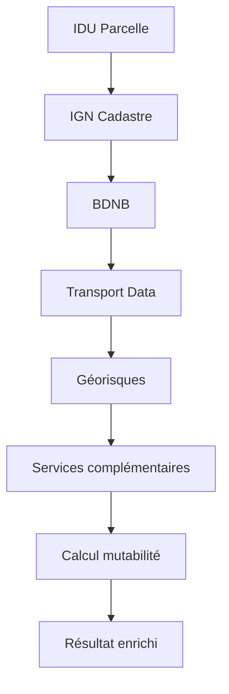

# APIs & Datasets externes

Mutafriches s'appuie sur un écosystème de données publiques et privées pour enrichir automatiquement les informations des friches urbaines.

Cette page centralise toutes les sources de données utilisées et leur rôle dans la chaîne d'enrichissement.

## 🎯 Vision générale

L'enrichissement d'une friche suit un processus en **3 étapes principales** :

```
📍 Localisation → 🔍 Enrichissement → 📊 Analyse de mutabilité

```

Chaque étape fait appel à des APIs spécialisées pour récupérer, valider et enrichir les données cadastrales, environnementales, réglementaires et d'accessibilité.

## 📋 Cartographie des sources de données

### 🏛️ **Données officielles publiques**

| **Source** | **Type** | **Utilisation** | **Statut** |
| --- | --- | --- | --- |
| [**IGN Cadastre**](./external-apis/ign-cadastre.md) | Service public gratuit | Géométrie, surface, commune | ✅ Implémenté |
| [**API BDNB**](./external-apis/api-bdnb.md) | Base de données publique | Performance énergétique, caractéristiques bâti | ✅ Implémenté |
| [**API ENEDIS**](./external-apis/api-enedis.md) | Service public | Raccordement électrique | ✅ Implémenté |
| **Transport Data Gouv** | Open data transport | Accessibilité transports en commun | 📋 Planifié |
| **Géorisques (BRGM)** | Service public | Risques naturels et technologiques | 📋 Planifié |

### 🗺️ **Données géospatiales**

| **Source** | **Type** | **Utilisation** | **Statut** |
| --- | --- | --- | --- |
| **Overpass (OpenStreetMap)** | Données collaboratives | Points d'intérêt, commerces, services | 📋 Planifié |
| **INSEE** | Données statistiques | Démographie, logements vacants | 📋 Planifié |

### 🏢 **Services spécialisés**

| **Source** | **Type** | **Utilisation** | **Statut** |
| --- | --- | --- | --- |
| **LOVAC** | Service métier | Données spécifiques friches | 📋 À évaluer |

## ⚙️ Architecture d'enrichissement

### Flux de données simplifié



### Principes techniques

- **Appels parallèles** : Optimisation des performances réseau
- **Fallbacks intelligents** : Robustesse en cas de défaillance partielle
- **Cache adaptatif** : Réduction de la charge sur les APIs publiques
- **Validation croisée** : Cohérence des données entre sources

## 🎛️ Gestion de configuration

### Mode développement

- **Mocks intégrés** : Simulation de toutes les APIs pour développement offline
- **Switch dynamique** : Basculement mock/réel via variable d'environnement
- **Données de test** : Jeux de données cohérents pour validation

### Mode production

- **Monitoring intégré** : Surveillance de la disponibilité des APIs
- **Rate limiting** : Respect des quotas et limites d'usage
- **Retry automatique** : Gestion des pannes temporaires

## 📊 Indicateurs de qualité

### Métriques de performance

- **Temps de réponse global** : < 5 secondes (objectif)
- **Taux de succès** : > 95% d'enrichissement complet
- **Couverture géographique** : 100% territoire français

### Fiabilité des données

- **Score de confiance** : Calculé selon la disponibilité des sources
- **Métadonnées** : Traçabilité complète des sources utilisées
- **Validation croisée** : Détection d'incohérences entre APIs

## 🚀 Évolution et roadmap

### Phase 1 (Actuelle) - MVP

- ✅ IGN Cadastre (géométrie, surface, commune)
- 🚧 BDNB (caractéristiques énergétiques)

### Phase 2 - Enrichissement complet

- 📋 Transport et accessibilité
- 📋 Risques et contraintes réglementaires
- 📋 Environnement et biodiversité

### Phase 3 - Intelligence augmentée

- 📋 ML/IA pour prédictions de mutabilité
- 📋 Recommandations d'usage optimisées
- 📋 Suivi temporel et alertes

## 📚 Documentation détaillée

Chaque API dispose de sa propre documentation technique détaillée :

[API IGN Cadastre](./external-apis/ign-cadastre.md)

[API BDNB](./external-apis/api-bdnb.md)

[API ENEDIS](./external-apis/api-enedis.md)

---

> Maintenance : Cette page est mise à jour à chaque intégration d'une nouvelle API ou modification de l'architecture d'enrichissement.
>