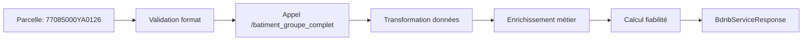

# API BDNB

# 🏢 Service d'enrichissement BDNB (Base de Données Nationale du Bâtiment)

Ce document explique le fonctionnement du service d'enrichissement des données bâtimentaires utilisant l'API BDNB.

## 🎯 Objectif

À partir d'un **Identifiant de Parcelle Cadastrale**, le service enrichit automatiquement les informations d'une friche en récupérant :

- La surface bâtie totale et l'emprise au sol
- Les caractéristiques détaillées des bâtiments (usage, état, matériaux)
- Les risques naturels (aléa argiles, radon, altitude)
- Les informations patrimoniales (proximité monuments historiques)
- La localisation précise (commune, adresse, quartier prioritaire)

## 🌐 API BDNB - Ressources

### Accès à l'API

- **URL de base** : `https://api.bdnb.io/v1/bdnb`
- **Documentation interactive** : <https://api-portail.bdnb.io/catalog/api/f4905edc-db58-3a3b-a8e5-c5dfc6692ee5>
- **Portail officiel** : <https://www.bdnb.io/>
- **Schéma de données** : <https://bdnb.io/documentation/schema-donnees>

### Caractéristiques

- **Gratuite** : API publique sans clé requise (version Open)
- **Service public** : Fourni par le CSTB et l'ADEME
- **Données officielles** : Croisement de 20+ sources (cadastre, DPE, fichiers fonciers...)
- **Format** : Réponses JSON standardisées
- **Couverture** : Tous les bâtiments de France métropolitaine + DROM

### Limites API publique

- **120 requêtes/minute**
- **10 000 requêtes/mois/IP**
- **10 objets maximum par requête**
- **Pas d'accès aux données expertes**

## 🔍 Format de l'Identifiant de Parcelle

L'identifiant de parcelle est une chaîne de 14 caractères structurée comme suit :

```
77085000YA0126
│││││││││││││││
├─────┤ Code INSEE commune (5 chiffres)
      ├──┤ Code complément (3 chiffres) 
         ├─┤ Section cadastrale (2 caractères)
           └───┤ Numéro de parcelle (4 chiffres)
```

**Exemple** : `77085000YA0126`

- **77085** : Chanteloup-en-Brie (Seine-et-Marne)
- **000** : Code complément
- **YA** : Section cadastrale
- **0126** : Numéro de parcelle

## ⚙️ Fonctionnement du service

### Architecture en appel unique optimisé

Le service utilise l'endpoint le plus complet de la BDNB pour récupérer toutes les données en une seule requête :



### 🏠 Appel `/batiment_groupe_complet/parcelle`

**Endpoint** : `/donnees/batiment_groupe_complet/parcelle`

**Paramètres** :

- `parcelle_id=eq.77085000YA0126` (filtrage PostgREST)
- `limit=100` (nombre maximum de bâtiments)

**Exemple d'URL** :

```
https://api.bdnb.io/v1/bdnb/donnees/batiment_groupe_complet/parcelle?parcelle_id=eq.77085000YA0126&limit=100
```

**Récupère par bâtiment** :

- `surface_emprise_sol` → Surface bâtie en m²
- `s_geom_groupe` → Surface d'emprise au sol
- `usage_niveau_1_txt` → Usage principal du bâtiment
- `annee_construction` → Année de construction
- `hauteur_mean`, `nb_niveau` → Caractéristiques physiques
- `mat_mur_txt`, `mat_toit_txt` → Matériaux de construction
- `alea_argiles`, `alea_radon` → Risques naturels
- `libelle_commune_insee` → Localisation
- `distance_batiment_historique_plus_proche` → Patrimoine

## 🔄 Traitements métier

### Validation d'entrée

- **Format parcelle** : Vérification longueur 14 caractères
- **Existence** : Validation via réponse API (tableau non vide)

### Enrichissement des données

| **Donnée enrichie** | **Source BDNB** | **Traitement** |
|---------------------|-----------------|----------------|
| **Surface bâtie totale** | `surface_emprise_sol` | Somme de tous les bâtiments |
| **État du bâtiment** | `annee_construction` | Calcul basé sur l'âge (Récent/Bon/Moyen/Ancien) |
| **Risques naturels** | `alea_argiles`, `alea_radon`, `altitude_sol_mean` | Extraction directe |
| **Localisation** | `code_commune_insee`, `libelle_commune_insee` | Normalisation |
| **Patrimoine** | `distance_batiment_historique_plus_proche` | Conversion en informations lisibles |
| **Fiabilité** | `fiabilite_emprise_sol`, `fiabilite_hauteur` | Score calculé sur 10 |

### Algorithme de détermination de l'état

```typescript
private determinerEtatBatiment(batiment: BdnbBatimentGroupeComplet): string {
  const age = currentYear - batiment.annee_construction;
  
  if (age <= 10) return 'Récent';
  if (age <= 30) return 'Bon état'; 
  if (age <= 50) return 'État moyen';
  return 'Ancien';
}
```

### Calcul du score de fiabilité

Le service calcule automatiquement un score de fiabilité (0-10) basé sur :

- **Fiabilité emprise au sol** : BONNE (2pts), MOYENNE (1pt), autre (0pt)
- **Fiabilité hauteur** : BONNE (2pts), MOYENNE (1pt), autre (0pt)  
- **Fiabilité croisement adresse** : fiables (2pts), autre (1pt)

Score final = `(somme des points / nombre de critères) * 5`

## 📊 Formats de réponse

### 1️⃣ Service `getSurfaceBatie()`

**Utilisation** : Récupération rapide de la surface bâtie uniquement

```typescript
interface ApiResponse<number> {
  success: boolean;
  data?: number;           // Surface en m²
  source: string;
  responseTimeMs?: number;
  error?: string;
}
```

**Exemple** :

```json
{
  "success": true,
  "data": 91,
  "source": "API BDNB - Données cadastrales enrichies",
  "responseTimeMs": 1250
}
```

### 2️⃣ Service `getBatiments()`

**Utilisation** : Données complètes enrichies pour l'analyse de mutabilité

```typescript
interface BdnbServiceResponse {
  parcelle: string;
  batiments: BdnbBatiment[];
  surfaceTotaleBatie: number;
  surfaceEmpriseAuSol: number;
  risquesNaturels?: BdnbRisquesNaturels;
  localisation?: BdnbLocalisation;
  patrimoine?: BdnbPatrimoine;
  fiabiliteEmpriseSol?: string;
  fiabiliteHauteur?: string;
  fiabiliteCroisementAdresse?: string;
}
```

### Détail des sous-structures

```typescript
interface BdnbBatiment {
  id: string;                    // batiment_groupe_id
  surface: number;               // surface_emprise_sol
  usage: string;                 // usage_niveau_1_txt
  etat: string;                  // calculé depuis annee_construction
  anneeConstruction?: number;
  hauteur?: number;
  nbNiveaux?: number;
  nbLogements?: number;
  materiauxMur?: string;         // mat_mur_txt
  materiauxToit?: string;        // mat_toit_txt
  classeEnergetique?: string;    // classe_bilan_dpe
}

interface BdnbRisquesNaturels {
  aleaArgiles?: string;          // "Faible" | "Moyen" | "Fort"
  aleaRadon?: string;            // "Faible" | "Moyen" | "Fort"
  altitudeMoyenne?: number;      // en mètres
}

interface BdnbLocalisation {
  codeCommune?: string;          // code_commune_insee
  libelleCommuneInsee?: string;  // nom officiel commune
  adressePrincipale?: string;    // libelle_adr_principale_ban
  quartierPrioritaire?: boolean; // quartier_prioritaire
}

interface BdnbPatrimoine {
  distanceBatimentHistorique?: number;        // en mètres
  nomBatimentHistorique?: string;
  perimetreBatimentHistorique?: boolean;
}
```

### Exemple de réponse complète

```json
{
  "success": true,
  "data": {
    "parcelle": "77085000YA0126",
    "batiments": [
      {
        "id": "bdnb-bg-1T83-LYS6-YM5D",
        "surface": 91,
        "usage": "Résidentiel individuel", 
        "etat": "Récent",
        "anneeConstruction": 2009,
        "hauteur": 6,
        "nbNiveaux": 2,
        "nbLogements": 1,
        "materiauxMur": "BRIQUES - AUTRES",
        "materiauxToit": "TUILES"
      }
    ],
    "surfaceTotaleBatie": 91,
    "surfaceEmpriseAuSol": 91,
    "risquesNaturels": {
      "aleaArgiles": "Moyen",
      "aleaRadon": "Faible", 
      "altitudeMoyenne": 117
    },
    "localisation": {
      "codeCommune": "77085",
      "libelleCommuneInsee": "Chanteloup-en-Brie",
      "adressePrincipale": "6 RUE DES CHARDONS BLEUS 77600 Chanteloup-en-Brie",
      "quartierPrioritaire": false
    },
    "patrimoine": {
      "distanceBatimentHistorique": null,
      "nomBatimentHistorique": null,
      "perimetreBatimentHistorique": false
    },
    "fiabiliteEmpriseSol": "BONNE",
    "fiabiliteHauteur": "BONNE"
  },
  "source": "API BDNB - Base de données nationale du bâtiment",
  "responseTimeMs": 1847,
  "fiabilite": 8.7
}
```

## 🚀 Performances

### Métriques typiques

- **Temps de réponse** : 800ms - 3s (selon la complexité de la parcelle)
- **Disponibilité** : 99.2% (service public récent)
- **Taille moyenne** : 2-15 bâtiments par parcelle urbaine
- **Cache** : Données mises à jour annuellement

### Optimisations implémentées

- **Appel unique** : Toutes les données en une requête
- **Limite raisonnable** : 100 bâtiments max pour éviter les timeouts
- **Transformation intelligente** : Enrichissement métier côté service
- **Calcul de fiabilité** : Score automatique pour qualifier les données

## ❌ Gestion d'erreurs

### Erreurs courantes

| **Erreur** | **Cause** | **Solution** |
|------------|-----------|--------------|
| `Aucun bâtiment trouvé` | Parcelle sans construction ou inexistante | Vérifier l'IDU ou accepter terrain nu |
| `Erreur API BDNB (429)` | Limite de taux dépassée | Attendre ou passer à l'API payante |
| `Erreur API BDNB (500)` | Problème technique côté BDNB | Retry automatique |
| `Timeout` | Parcelle avec énormément de bâtiments | Réduire la limite ou découper |

### Codes de retour

```json
// Succès avec données
{
  "success": true,
  "data": { /* BdnbServiceResponse */ },
  "source": "API BDNB - Base de données nationale du bâtiment",
  "responseTimeMs": 1847,
  "fiabilite": 8.7
}

// Échec - parcelle vide
{
  "success": false,
  "error": "Aucun bâtiment trouvé pour la parcelle 77085000YA0999",
  "source": "API BDNB",
  "responseTimeMs": 923
}
```

## 🧪 Tests et validation

### Parcelles de test validées

```json
{
  "77085000YA0126": "Chanteloup-en-Brie - Maison récente 91m² (doc officielle)",
  "751160001AB0001": "Paris 16e - Zone urbaine dense", 
  "691230001AC0001": "Lyon - Test métropole",
  "130010001AA0001": "Marseille - Test sud France",
}
```

### Parcelles d'erreur pour tests

```json
{
  "999990000XX9999": "Parcelle inexistante",
  "000000000AA0000": "Parcelle sans bâtiment"
}
```

### Outils de debug

- **Endpoint de comparaison** : `/test/bdnb/compare?parcelle=XXX`
- **URLs BDNB directes** : Pour validation manuelle
- **Health check** : `/test/bdnb/health`
- **Logs détaillés** : Traçabilité complète des transformations

## 📈 Évolution et roadmap

### Versions de l'API BDNB

- **API Open** : Utilisée actuellement (gratuite, limitée)
- **API Open+** : 1M requêtes/mois, 1000 objets/requête
- **API Expert** : Données avancées, analyses personnalisées

### Intégration future possible

- **Données énergétiques** : DPE, consommations réelles
- **Données économiques** : Valeurs foncières, marchés
- **Données environnementales** : Empreinte carbone, matériaux

## 📚 Ressources complémentaires

### Documentation officielle BDNB

- [Portail principal](https://www.bdnb.io/)
- [Documentation API](https://bdnb.io/documentation/api)
- [Schéma de données complet](https://bdnb.io/documentation/schema-donnees)
- [OpenAPI Specification](https://api.bdnb.io/v1/bdnb/docs)

### Outils externes

- **Interface graphique** : <https://app.bdnb.io/>
- **Données sources** : <https://bdnb.io/documentation/sources>
- **Cas d'usage** : <https://bdnb.io/cas-usage>

### Sources de données BDNB

La BDNB agrège plus de 20 sources officielles :

- **Cadastre** (parcelles, bâtiments)
- **DPE** (diagnostics énergétiques)  
- **Fichiers fonciers** (transactions)
- **RNB** (référentiel national des bâtiments)
- **INSEE** (logements, population)
- **ADEME** (données environnementales)

---

> **Note importante** : La BDNB est mise à jour annuellement. Les données peuvent avoir jusqu'à 1 an de décalage avec la réalité terrain. Pour des projets critiques, croiser avec d'autres sources ou effectuer des vérifications terrain.
